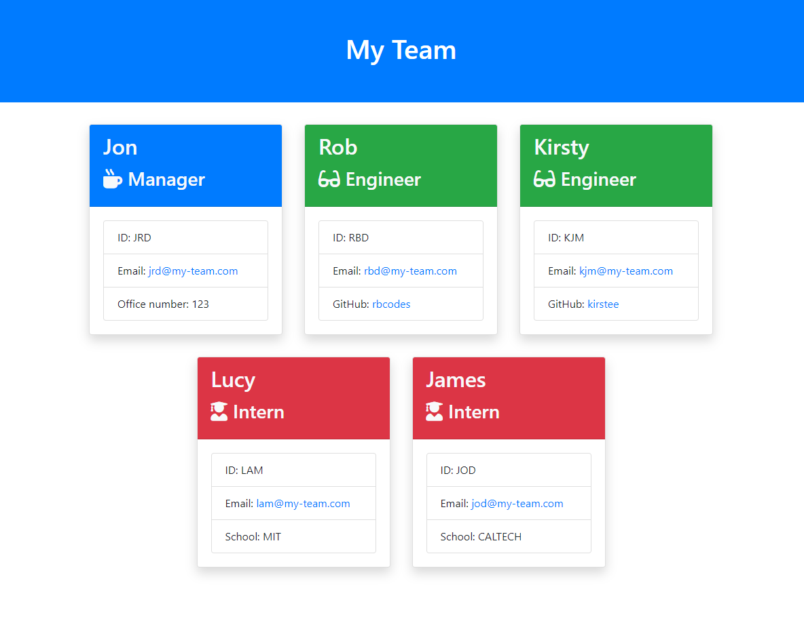

# Team Profile Generator

## Description
A command line utility that generates a team roster HTML page from user input.

[Download Application](https://github.com/trunten/ubbc-team-profile-generator/archive/refs/heads/main.zip)

### User Story
- As a manager a user want to generate a webpage that displays my team's basic info so that a user have quick access to their emails and GitHub profiles.

### Acceptance Criteria
- This application will take in information about employees on a software engineering team, then generate an HTML webpage that displays summaries for each person.

## Table of contents
- [Installation](#installation)
- [Usage](#usage)
- [Tests](#tests)
- [Credits](#credits)
- [Contributing](#contributing)
- [License](#license)

## Installation
- Open your terminal and navigate to the application's containing folder
- Run the following command in your terminal to install application dependancies: <code>npm i</code>

## Usage
- Install project dependancies using the command detailed in the [installation](#installation) section
- Run the following command in your terminal: <code>node index.js</code>
- Answer the questions presented by typing your response in the terminal
- Your <code>team.html</code> file will be output to the <code>output</code> sub-folder 
- Example output:

## Tests
- First ensure you have installed the project dependancies using the command detailed in the [installation](#installation) section
- Run the following command in your terminal: <code>npm test</code>

## Credits
- Email Validation regex: https://www.oreilly.com/library/view/regular-expressions-cookbook/9781449327453/ch04s01.html

## Contributing
Pull requests are welcome. For major changes, please open an issue first to discuss what you would like to change.

This repo adopts the [Contributor Covenant](https://www.contributor-covenant.org/version/2/1/code_of_conduct/) for contributing guidlines.

## Questions
- Github Profile: [trunten](https://github.com/trunten)
- Contact me for any questions you may have via email at [trunten@btinternet.com](mailto:trunten@btinternet.com)

## License

This project is licensed under the [MIT License](https://choosealicense.com/licenses/mit/)

Refer to the [license](LICENSE) in the repo
